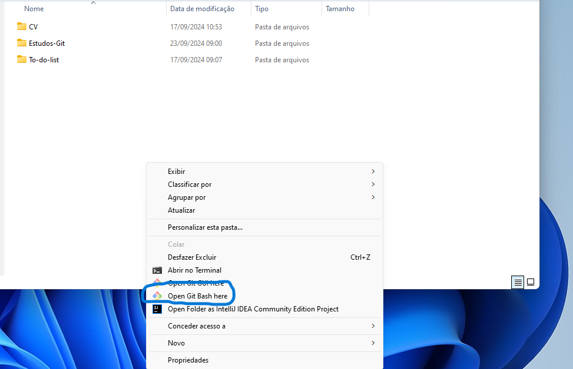
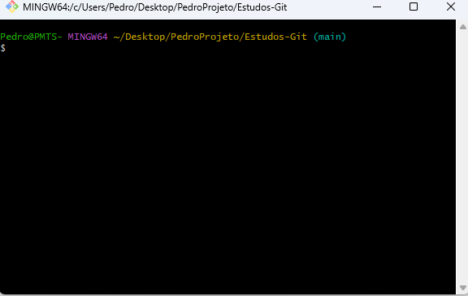
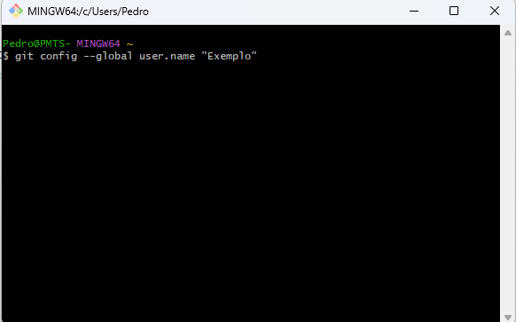

# Sumario

1. [Git](#git-e-github)

2. [Comandos básicos do git](comandos_basicos.md)

3. [Boas praticas do Commits](commits.md)

4. [Boas praticas do Branchs](branchs.md)

5. [Comandos via terminal](terminal.md)

6. [Arquivos do Git](ArquivosGit.md)

7. [Comandos Avançados do git](comandos_avancados.md)

8. [Conceitos](Conceitos.md)

9. [Restauração de arquivos do git](Restaurar.md)

10. [Git fora do git bash](#autenticar-caso-esteja-fora-do-terminal-git)


## Git e github
Git é um sistema de controle de versão distribuído amplamente utilizado para gerenciar projetos de desenvolvimento de software. Ele permite que você acompanhe as alterações feitas em arquivos ao longo do tempo, facilitando a colaboração entre equipes e o gerenciamento de versões. Com o Git, você pode:

- **Registrar Mudanças**: Guarde um histórico detalhado de todas as alterações feitas nos arquivos do seu projeto.
- **Colaborar com Outros**: Trabalhe em conjunto com outros desenvolvedores, permitindo que cada um faça suas alterações e combine-as de forma eficiente.
- **Reverter Alterações**: Se algo não sair como planejado, você pode facilmente voltar a uma versão anterior do seu projeto.

### Como Baixar e Instalar o Git

Para começar a usar o Git, siga os passos abaixo para baixá-lo e instalá-lo em seu sistema:

1. **Acesse o Site Oficial do Git**  
   Vá até [git](https://git-scm.com/) para acessar o site oficial do Git.

2. **Baixe o Instalador**  
   Na página inicial, você verá um botão de download que detectará automaticamente seu sistema operacional (Windows, macOS ou Linux). Clique no botão para baixar o instalador apropriado.

3. **Execute o Instalador**  
   Após o download, localize o arquivo e execute o instalador. Siga as instruções na tela para completar a instalação. Durante a instalação, você pode aceitar as configurações padrão ou personalizá-las conforme necessário.

4. **Verifique a Instalação**  
   Após a instalação, abra seu terminal (ou prompt de comando) e execute o seguinte comando para verificar se o Git foi instalado corretamente:


## Configurando o git

Para abrir o Git Bash diretamente dentro da pasta do seu projeto, siga estas etapas:

1. **Navegue até a Pasta do Projeto**:
   - Abra o **Explorador de Arquivos** e localize a pasta onde seu projeto está armazenado.

2. **Clique com o Botão Direito do Mouse**:
   - Dentro da pasta do projeto, clique com o botão direito em qualquer área em branco (não em cima de arquivos ou pastas).

3. **Selecione "Git Bash Here"**:
   - No menu que aparece, clique na opção **"Git Bash Here"**. 

   - **Abrindo o git bash:** 


4. **Aqui iremos executar todos os comandos:**
   -  

   -  Ao abrir o ```git bash``` ele virá como uma folha em branco, então temos que configurar:

## Comandos para configurar 1° vez:
O primeirocomando que iremos executar no ``git bash`` é o seguinte: 

- git config --global user.name "seuNome"



- git config --global user.email "seuEmail@example.com"


## Comandos para desconfigurar:
- git config --global --unset user.name
- git config --global --unset user.email


## Autenticar (caso esteja fora do terminal Git)

Se você estiver utilizando um ambiente de desenvolvimento que não tenha acesso direto ao terminal Git, como o [Replit](https://replit.com/login), você irá precisar autenticar sua conta do GitHub. Isso é importante para garantir que você possa acessar repositórios, fazer commits e interagir com o GitHub diretamente a partir desse ambiente. Para autenticar é bem simples. siga o passo a passo abaixo:


1. **Login no GitHub**  
   Execute o comando abaixo para confirmar a autenticação:  
   `gh auth login`

2. **Configurar Nome de Usuário**  
   Para assinar seus commits com seu nome, use:  
   `git config --global user.name "seuNome"`

3. **Configurar E-mail**  
   Para assinar seus commits com seu e-mail, use:  
   `git config --global user.email "seuEmail@example.com"`

4. **Partiu se divertir**  
   Depois de ter feito os passos 1 , 2 e 3, você ja etsá pronto para se divertir com o **git**, você pode começar por [aqui](comandos_basicos.md).
